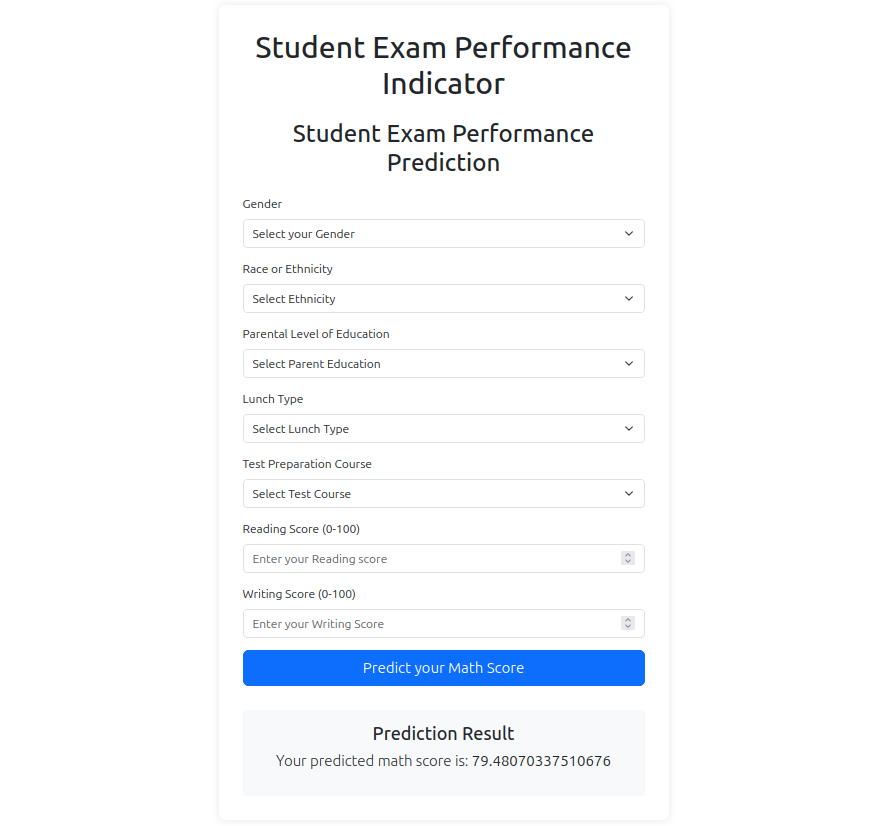

# Student Performance Predictor 🎓📊

[](https://python.org)
[](https://scikit-learn.org)
[](https://flask.palletsprojects.com)
[](https://xgboost.ai)
[](https://catboost.ai)

n end-to-end machine learning project for educational purposes, demonstrating the complete ML pipeline from data analysis to deployment. This project predicts student math scores while serving as a practice template for:

- Feature engineering
- Model comparison and hyperparameter tuning
- ML pipeline development
- Flask web application deployment
- Production-grade logging and error handling

Perfect for ML practitioners looking to understand full-stack data science implementations.



## 📌 Features

- Predicts math scores with ~88% accuracy (R2 score)
- Compares multiple ML algorithms (Linear Regression, Random Forest, XGBoost, etc.)
- Simple web interface for easy predictions
- Comprehensive model training logs

## 🛠️ Tech Stack

### Core ML


### Web Interface


## 📊 Dataset Overview

| Feature | Description | Values |
|---------|-------------|--------|
| gender | Sex of student | Male/Female |
| race/ethnicity | Ethnicity group | Group A, B, C, D, E |
| parental level of education | Parents' final education | bachelor's degree, some college, master's degree, etc. |
| lunch | Lunch before test | standard or free/reduced |
| test preparation course | Test prep status | none or completed |
| math_score | Math test score | 0-100 |
| reading_score | Reading test score | 0-100 |
| writing_score | Writing test score | 0-100 |

**Sample Data:**
```csv
gender,race_ethnicity,parental_level_of_education,lunch,test_preparation_course,math_score,reading_score,writing_score
female,group B,bachelor's degree,standard,none,72,72,74
female,group C,some college,standard,completed,69,90,88
```

## 🚀 Installation

1. Clone the repository:
```bash
git clone https://github.com/Phantom-VK/Student-performance-prediction
cd student-performance-predictor
```

2. Create and activate virtual environment:
```bash
python -m venv venv
source venv/bin/activate  # On Windows: venv\Scripts\activate
```

3. Install dependencies:
```bash
pip install -r requirements.txt
```

## 🏃‍♂️ Usage

1. Run the Flask application:
```bash
python app.py
```

2. Access the web interface at:
```
http://localhost:5000
```

3. For predictions, visit:
```
http://localhost:5000/predictdata
```

## 🧠 Model Training

The system evaluates multiple algorithms:

```python
models = {
    "Decision Tree": DecisionTreeRegressor(),
    "Random Forest": RandomForestRegressor(),
    "Gradient Boosting": GradientBoostingRegressor(),
    "Linear Regression": LinearRegression(),
    "XGBoost": XGBRegressor(),
    "CatBoost": CatBoostRegressor(verbose=False),
    "AdaBoost": AdaBoostRegressor()
}
```

### Training Results
- **Best Model**: Linear Regression (R2: 0.8804)
- **Top Performers**:
  - Gradient Boosting (R2: 0.8763)
  - Random Forest (R2: 0.8529)
  - CatBoost (R2: 0.8566)

**Training Log Excerpt:**
```
[2025-06-22 14:56:51,898] Linear Regression test R2 score: 0.8804
[2025-06-22 14:56:51,884] Gradient Boosting test R2 score: 0.8763
[2025-06-22 14:56:45,707] Random Forest test R2 score: 0.8529
```

## 📝 Requirements

```
pandas~=2.3.0
numpy~=2.3.0
scikit-learn~=1.7.0
catboost~=1.2.8
xgboost~=3.0.2
Flask~=3.1.1
dill~=0.4.0
```

```